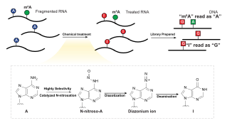

# m<sup>6</sup>A-CAMseq



## Qucik start

- Prepare configuration file

_minimum configuration example:_

```yaml
reference:
  genes:
    - ./ref/spike-in.fa
    - ./ref/Arabidopsis_thaliana.rRNA.fa
  genome:
    - /data/reference/genome/Arabidopsis_thaliana/TAIR10.fa

# TODO: automatically generate index (?)
genome_index: /data/reference/genome/Arabidopsis_thaliana/hisat2_tx_3n/TAIR10.release57

samples:
  test1:
    - R1: ../test/test_R1.fq.gz
      R2: ../test/test_R2.fq.gz
```

_advanced configuration:_

```yaml
# set library preparation method
# can be "STRANDED", "ECLIP10", etc, refer to the cutseq documentation for more information
libtype: STRANDED

# by default, the pipeline will use the strandness information from the library
# if the strandness is not available, set the strandness to `false`
strandness: true

# by default, the pipeline will force remove the PCR duplicates based on the UMI
# if UMI is not available, you can toggle the markdup to `false` to skip the PCR duplicate removal
markdup: true
```

- Install apptainer and run

```bash
apptainer run -B /data docker://y9ch/camseq -c data.yaml -j 48
```

## Customization

System Requirements

This package has been tested on Linux operating systems. It requires the following software dependencies:

- [Python](https://www.python.org/downloads/) 3.7 or higher
- [Snakemake](https://snakemake.readthedocs.io/en/stable/getting_started/installation.html) 8.0.0 or higher
- [hisat2-3n](https://github.com/DaehwanKimLab/hisat2/tree/hisat-3n)
- cutseq

## Documentation

The documentation is available at [https://y9c.github.io/m6A-CAMseq/](https://y9c.github.io/m6A-CAMseq/)

&nbsp;

<p align="center">

</p>
<p align="center">
Copyright &copy; 2023-present
<a href="https://github.com/y9c" target="_blank">Chang Y</a>
</p>
<p align="center">
